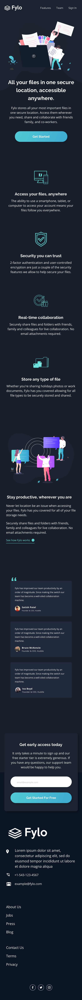

#  Frontend Mentor -  Flylo-dack-theme

This is my solution to the [Fylo dack theme landing page Challenge on Frontend Mentor].

* Note:there are so many ways to complete this challenge, so this is my own way of completing the challenge.

# Challenge

Users should be able to:

- View the optimal layout for the site depending on their device's screen size.
- See hover states for all interactive elements on the page.

# Screenshot

# Links

- My Solution URL:https://github.com/PRAISE-C24/Flylo-dack-theme
- Live Site URL: https://praise-c24.github.io/Flylo-dack-theme/

# Built with

- Semantic HTML5 markup
- Css
- JavaScript
- Mobile-first workflow

# What I learned
I learned how to make a web page with multiple features resposive.

I learned a lot about the Css position propertiy.

And I also learned how to use images to add some cool features to a web page.

# Useful resources

- w3school :https://www.w3schools.com/css/css_positioning.asp - the w3school web doc helped me understand some of the css position properties.

## Author

- Name - PRAISE CHIBUZOR
- Twitter - @PRAISE_C24
- Frontend Mentor - @PAISE-C24 (https://www.frontendmentor.io/profile/PRAISE-C24)
